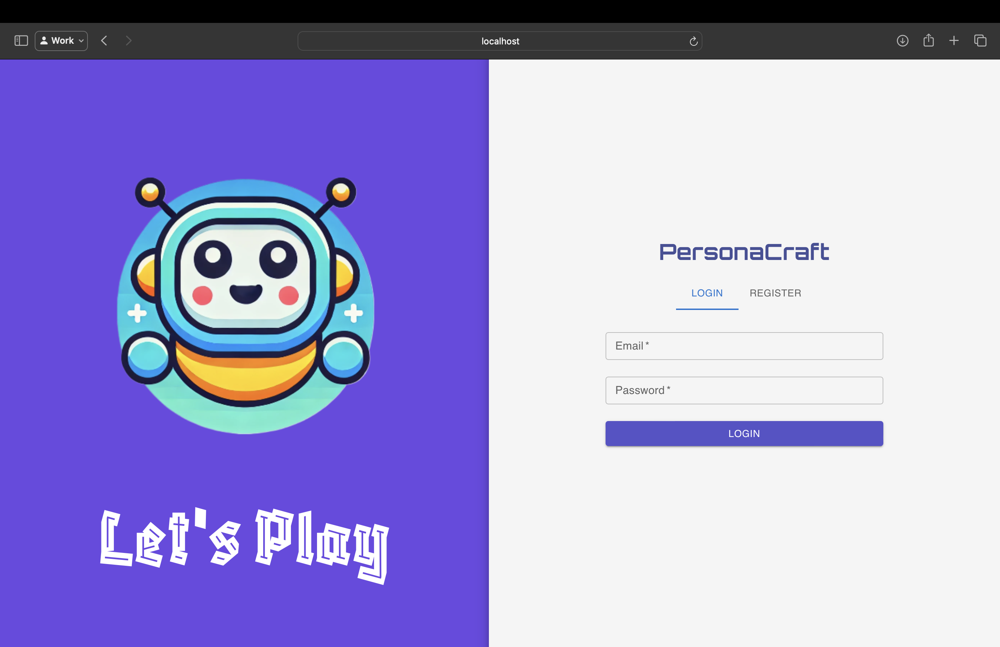
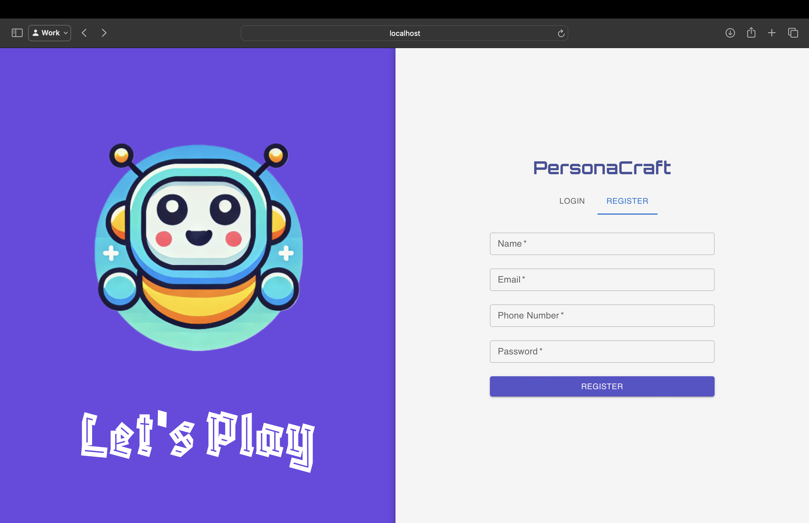
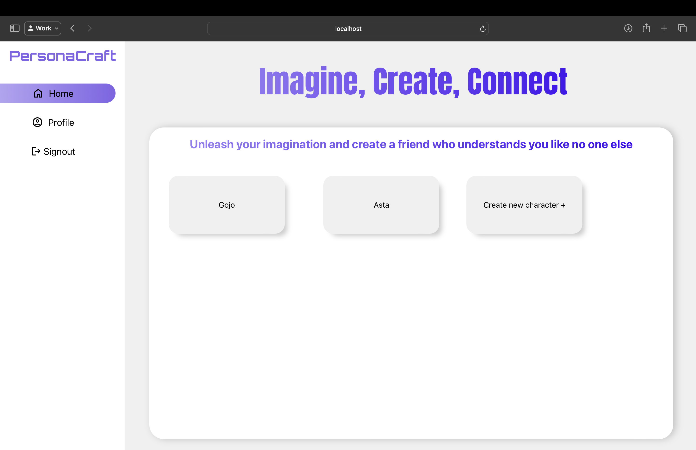
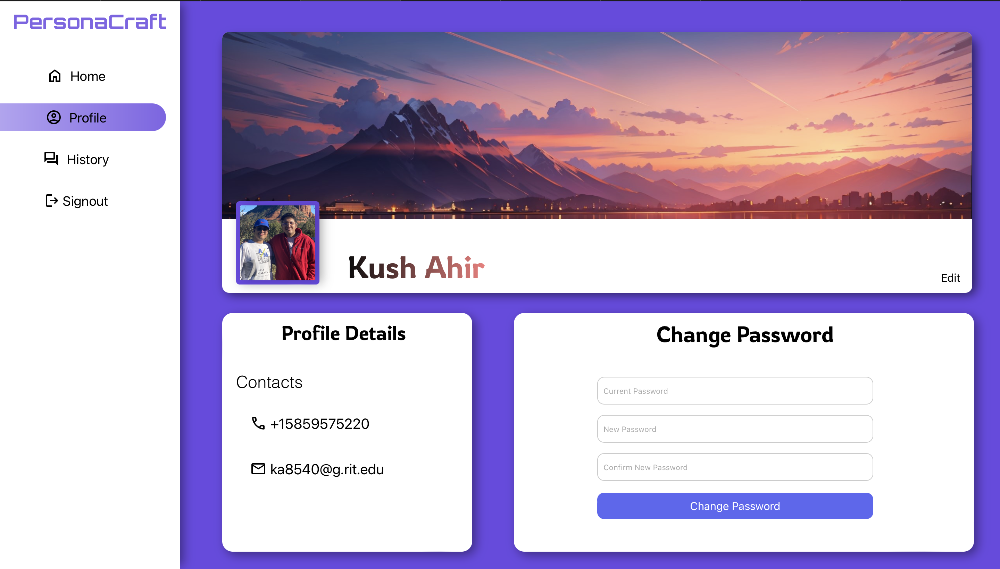
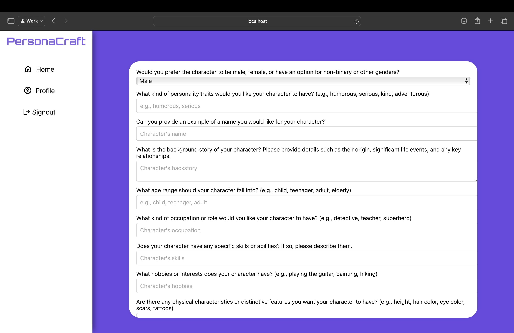
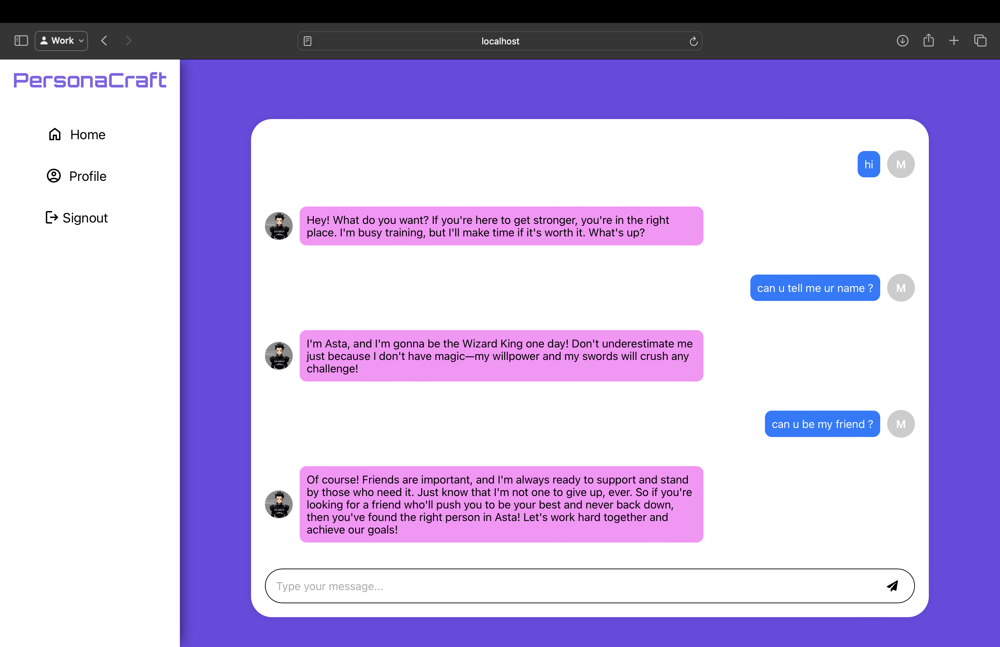

# PersonaCraft

Welcome to PersonaCraft, where your creativity meets conversational AI to bring your own fictional characters to life! This innovative platform empowers you to design and interact with characters, fostering unique and meaningful connections. PersonaCraft serves as a virtual sanctuary for both entertainment and companionship, allowing you to explore the realms of your imagination while experiencing the joy of creating and chatting with a character of your own making.

## How PersonaCraft Helps

PersonaCraft is designed to enrich your daily life by providing a creative outlet and a companion in one. Here's how it can benefit you:

- **Creativity Booster**: Unleash your imagination by creating characters with their own stories, personalities, and traits.
- **Emotional Support**: Engage with your character for companionship and comfort, reducing feelings of loneliness and stress.
- **Interactive Learning**: Improve your communication skills and explore various interpersonal interactions through your character.
- **Entertainment**: Enjoy fun and engaging conversations that make each day a little more interesting and joyful.

## Features

PersonaCraft offers a suite of features to enhance your experience as you bring your characters to life:

1. **Create Your Own Character**: Start from scratch and design a unique character with specific traits, background, and personality.
2. **Update AI Pictures**: Automatically generate and update your character's pictures based on the descriptions you provide, ensuring they always match their evolving story.
3. **Select Browse Picture**: Choose a specific image for your character from a curated gallery to perfectly fit the vision in your mind.
4. **Chat with Characters**: Dive into dynamic conversations with your character, powered by advanced AI, making each interaction feel real and engaging.
5. **Update Your Profile Picture**: Personalize your user profile with your chosen image to enhance your interaction with the app.

## Pages Overview

### Login Page

The **Login page** of PersonaCraft is designed to provide users with a straightforward and secure entry point into their personalized character interaction experience. Featuring a minimalistic design, the page includes fields for entering an **Email** and **Password**, ensuring quick and easy access. The page's clean layout, dominated by soothing purple tones and the engaging PersonaCraft robot mascot, offers an inviting atmosphere for returning users.

- **Fields**: Email, Password
- **Features**: Simple, user-friendly interface with secure login functionality.
- **Design**: Clean, minimalistic with PersonaCraft branding and colors.

### Registration Page

PersonaCraft’s **Registration page** is set up to welcome new users to the platform, allowing them to start their journey in creating and interacting with fictional characters. The registration form is simple and user-friendly, requesting essential details such as **Name**, **Email**, **Phone Number**, and **Password**. This ensures that users can quickly set up their account without hassle. Similar to the login page, the registration page maintains a consistent aesthetic with the site’s branding, featuring vibrant colors and playful graphics, which enhance the user experience and set the tone for creative engagement.

- **Fields**: Name, Email, Phone Number, Password
- **Features**: Easy account setup with essential user details for personalized experience.
- **Design**: Engaging and colorful, with PersonaCraft thematic elements.

### PersonaCraft Dashboard

The **PersonaCraft Dashboard** is the central hub for user interaction and creativity on the platform. It's designed to provide a seamless and intuitive experience, allowing users to easily manage and interact with their personalized AI characters.

#### Key Features of the Dashboard

#### Character Management

- **Existing Characters**: The dashboard prominently displays existing characters such as Gojo and Asta in an accessible card format. Each card offers quick access to further interact and develop the character's story.
- **Create New Character**: A clearly marked button, "Create new character +", invites users to embark on the creation of a new character. This feature guides users through a detailed setup process to define unique traits and backstory.

#### User-Friendly Navigation

- **Home**: Directs users back to the main overview of all their characters.
- **Profile**: Allows users to customize their personal profile settings.
- **Signout**: Provides a simple and secure way to log out of the application.

#### Creative and Connective Experience

- **Tagline**: "Unleash your imagination and create a friend who understands you like no one else," this encourages ongoing engagement and exploration within the PersonaCraft universe.
- **Design**: With a focus on aesthetics, the dashboard features a clean, modern look that enhances user interaction without overwhelming the creative process.

### Profile Page Overview

The **Profile Page** in PersonaCraft is where users can view and manage their personal details and settings. It combines functionality with aesthetic appeal for a satisfying user experience.

#### Key Features

- **Personal Information Display**: Showcases the user's name, profile picture, and contact details, enhancing personal connection and ease of access.
- **Edit Profile**: Allows users to update their personal information and profile picture, ensuring their PersonaCraft account remains up-to-date.
- **Change Password**: Provides a secure method to update login credentials, with fields for current and new passwords to maintain account security.

### PersonaCraft Character Creation Dashboard

The **Character Creation Dashboard** in PersonaCraft provides an intuitive and detailed interface for users to create and customize their fictional characters. This dashboard is designed to facilitate deep customization, allowing users to define their characters with great specificity and creativity.

#### Key Features of the Character Creation Dashboard

##### Comprehensive Customization Form

- **Gender Selection**: Users can select the gender of their character, with options including male, female, non-binary, or other genders, ensuring inclusivity and personal relevance.
- **Personality Traits**: A field for defining personality traits allows users to specify the character's demeanor, such as humorous, serious, kind, or adventurous.
- **Name and Backstory**: Users can input a character's name and craft a detailed backstory, providing context about the character's origin, significant life events, and key relationships.
- **Age Range**: The dashboard allows selection of an age range for the character, such as child, teenager, adult, or elderly, to align the character's experiences and outlook appropriately.
- **Occupation and Role**: Users can define the character's occupation or role, whether it's a detective, teacher, superhero, or any other role that fits the character's narrative.
- **Skills and Abilities**: There is a section to describe any special skills or abilities the character possesses, adding to their depth and functionality within their world.
- **Hobbies and Interests**: Users can add hobbies or interests, further personalizing the character's daily activities and preferences.
- **Physical Characteristics**: The form includes options to specify physical attributes such as height, hair color, eye color, and any distinctive features like scars or tattoos.

### Chat Interface

The **Chat Interface** in PersonaCraft is where the magic of interaction comes alive. This feature allows users to engage in real-time conversations with their created characters, making each character feel truly alive and responsive.

#### Key Features of the Chat Interface

- **Dynamic Conversations**: Engage in real-time chat with characters who respond based on their developed personalities and backgrounds. Whether it's a motivational character like Asta who aspires to be the Wizard King or any other persona, each character brings their unique flair to the conversation.
- **Contextual Responses**: The AI behind PersonaCraft is designed to understand and react to user inputs intelligently, providing responses that are not only in character but also contextually appropriate to the ongoing discussion.
- **User-Friendly Design**: The chat interface is clean and intuitive, with a simple text input field at the bottom and a conversation area above. This layout ensures that users can easily type and view messages, focusing on the interaction without distractions.
- **Emotional Connection**: This feature is designed to enhance the emotional engagement between the user and their character, providing a space where deep and meaningful interactions can foster a sense of companionship and friendship.

## Engage with Your Creation

PersonaCraft is not just a platform; it's a gateway to a new dimension of creativity and companionship. Whether you're a writer seeking inspiration, someone looking for a friendly chat, or a creative soul eager to explore new ideas, PersonaCraft offers a unique blend of storytelling and interaction that adapts and grows with you. Dive into your imagination and create characters that bring joy, wisdom, and adventure into your life.

Start your journey today and see where your creativity takes you!

